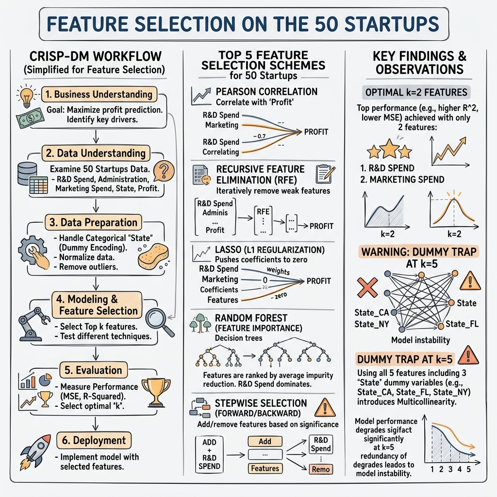
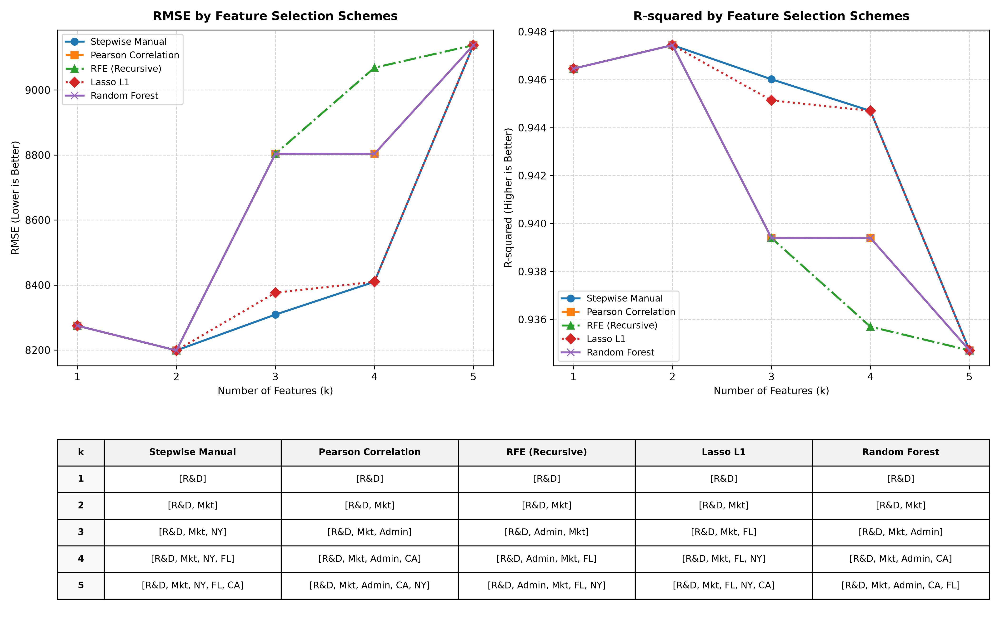
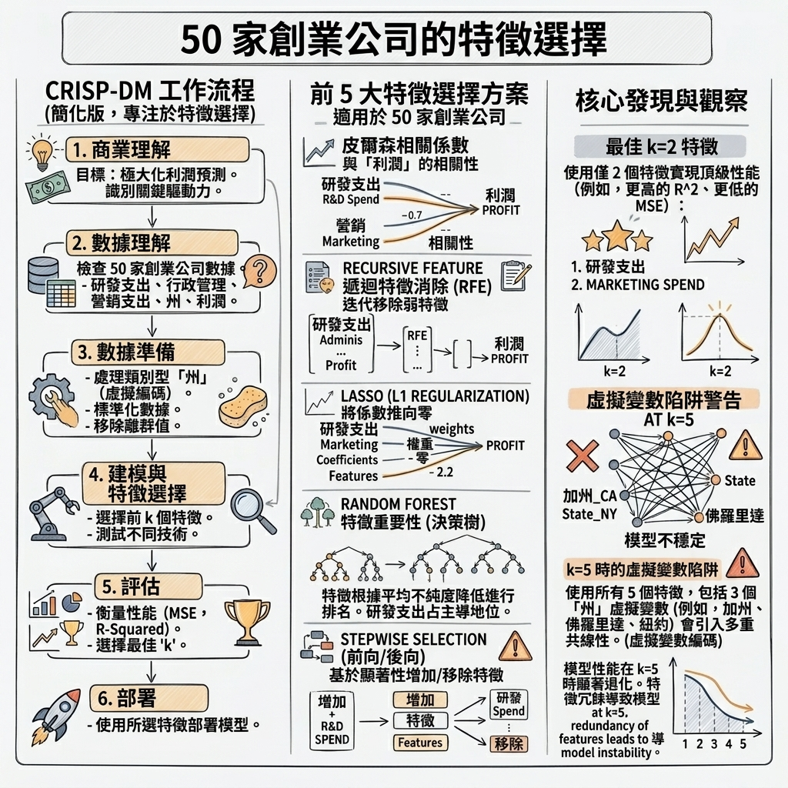

# 50 家創業公司特徵選擇與機器學習預測專案

本專案是一個結合了機器學習預測系統（CRISP-DM 流程）、互動式網頁簡報系統與學術級技術白皮書的綜合性專案。本專案探討研發投入、行政管理費用與行銷投入對新創公司利潤的關聯與預測效果。

## 今日成果與交付物匯總表

以下為今日產出的核心成果匯總，點擊「成果開啟連結」即可直接於瀏覽器或本機程式中開啟該檔案：

| 成果類別 | 成果項目 | 成果開啟連結 | 功能說明與即時預測預覽 |
| :--- | :--- | :--- | :--- |
| **互動簡報（PPT）** | 機器學習與特徵選擇簡報 | [tutorial_slideshow.html](file:///d:/2026中興大AI人工智慧與數據/陳煥教授/Homework/HW6/tutorial_slideshow.html) | 採用 16:9 寬螢幕手繪風格設計，內建 OLS 即時預測模擬計算器與相關性矩陣。 |
| **簡報錄影** | 簡報動態錄製展示影片 | [tutorial_slideshow.mp4](file:///d:/2026中興大AI人工智慧與數據/陳煥教授/Homework/HW6/tutorial_slideshow.mp4) | 基於 Playwright 網頁自動化，模擬點擊簡報與調整滑桿的互動過程錄影檔。<br><br> |
| **技術白皮書** | 深度技術學術白皮書 PDF | [technical_whitepaper_v3.pdf](file:///d:/2026中興大AI人工智慧與數據/陳煥教授/Homework/HW6/technical_whitepaper_v3.pdf) | A4 分頁優化、具備 MathJax 高解析度公式排版的學術級白皮書，推導共線性原理。 |
| **中文白皮書** | 專案智慧白皮書中文版 PDF | [智慧白皮書.pdf](file:///d:/2026中興大AI人工智慧與數據/陳煥教授/Homework/HW6/智慧白皮書.pdf) | 本專案中文版學術白皮書 PDF 檔。 |
| **資訊圖表** | 專案流程手繪資訊圖表 | [infographic_excalidraw_zh.png](file:///d:/2026中興大AI人工智慧與數據/陳煥教授/Homework/HW6/infographic_excalidraw_zh.png) | 展現特徵篩選與 CRISP-DM 工作流的手繪風資訊圖表。<br><br> |
| **性能曲線** | 特徵選擇方案性能對比圖 | [allinone.png](file:///d:/2026中興大AI人工智慧與數據/陳煥教授/Homework/HW6/allinone.png) | 五大特徵選擇機制在不同 k 值下的 RMSE 與 R-squared 變化趨勢圖。<br><br> |
| **特徵篩選圖** | 創業公司特徵選擇分析圖 | [50家創業公司的特徵選擇.png](file:///d:/2026中興大AI人工智慧與數據/陳煥教授/Homework/HW6/50家創業公司的特徵選擇.png) | 對 50 家創業公司進行特徵篩選評估之長條圖結果。<br><br> |

---

## 目錄結構與檔案說明

專案內包含以下核心檔案，您可以點擊連結直接訪問：

### 1. 機器學習與預測系統
*   [app.py](file:///d:/2026中興大AI人工智慧與數據/陳煥教授/Homework/HW6/app.py)：採用 Excalidraw 手繪白板風格設計的互動式 Streamlit 控制台，包含即時利潤預測與數據分析。
*   [solve_50_startups_crispdm_v1.py](file:///d:/2026中興大AI人工智慧與數據/陳煥教授/Homework/HW6/solve_50_startups_crispdm_v1.py)：完整的 CRISP-DM 機器學習工作流腳本，包含數據預處理、5 種特徵選擇機制，並將最佳模型序列化儲存。
*   [plot_metrics.py](file:///d:/2026中興大AI人工智慧與數據/陳煥教授/Homework/HW6/plot_metrics.py)：用於評估與繪製 5 種特徵篩選方案在 k = 1 至 k = 5 時的 RMSE 與 R-squared 性能曲線，輸出對照圖表。
*   [50_Startups.csv](file:///d:/2026中興大AI人工智慧與數據/陳煥教授/Homework/HW6/50_Startups.csv)：本專案所使用的 Kaggle 創業公司數據集。
*   [startup_profit_model_v1.pkl](file:///d:/2026中興大AI人工智慧與數據/陳煥教授/Homework/HW6/startup_profit_model_v1.pkl)：經由 R&D Spend 與 Marketing Spend 重新擬合訓練後的最終 Pipeline 預測模型。
*   [design.md](file:///d:/2026中興大AI人工智慧與數據/陳煥教授/Homework/HW6/design.md)：機器學習預測系統的規格設計與特徵分析定義文件。

### 2. 互動式網頁簡報系統與影片錄製
*   [tutorial_slideshow.html](file:///d:/2026中興大AI人工智慧與數據/陳煥教授/Homework/HW6/tutorial_slideshow.html)：50 家創業公司特徵篩選與 CRISP-DM 流程教學簡報（16:9 寬螢幕手繪風），內建即時 OLS 預測模擬計算器與相關性矩陣卡片。
*   [record_slideshow.py](file:///d:/2026中興大AI人工智慧與數據/陳煥教授/Homework/HW6/record_slideshow.py)：基於 Playwright 網頁自動化的簡報影片錄製腳本，能啟動本機伺服器、模擬操作點擊（如特徵方案切換、數值滑動）並自動存檔。
*   [tutorial_slideshow.mp4](file:///d:/2026中興大AI人工智慧與數據/陳煥教授/Homework/HW6/tutorial_slideshow.mp4)：錄製生成的簡報影片檔案，方便於常見影音播放器觀看。

### 3. 技術白皮書與 PDF 編譯
*   [technical_whitepaper.md](file:///d:/2026中興大AI人工智慧與數據/陳煥教授/Homework/HW6/technical_whitepaper.md)：超過 34,000 字元的深度技術白皮書，詳盡推導多重共線性數學原理並解構特徵選擇。
*   [generate_pdf.py](file:///d:/2026中興大AI人工智慧與數據/陳煥教授/Homework/HW6/generate_pdf.py)：基於 Headless Chrome 渲染的 PDF 自動編譯腳本。
*   [technical_whitepaper_v3.pdf](file:///d:/2026中興大AI人工智慧與數據/陳煥教授/Homework/HW6/technical_whitepaper_v3.pdf)：編譯產出的圖文並茂 PDF 技術白皮書，避免跨頁截斷問題，具備 MathJax 高解析度排版。
*   [智慧白皮書.pdf](file:///d:/2026中興大AI人工智慧與數據/陳煥教授/Homework/HW6/智慧白皮書.pdf)：專案的中文版白皮書 PDF 檔。

### 4. 輔助圖表
*   [50 家創業公司的特徵選擇.png](file:///d:/2026中興大AI人工智慧與數據/陳煥教授/Homework/HW6/50家創業公司的特徵選擇.png)：創業公司特徵選擇與評估結果圖表。

    

*   [allinone.png](file:///d:/2026中興大AI人工智慧與數據/陳煥教授/Homework/HW6/allinone.png)：特徵選擇方案的預測指標（RMSE 與 R-squared）對比圖。

    

*   [metrics_chart.png](file:///d:/2026中興大AI人工智慧與數據/陳煥教授/Homework/HW6/metrics_chart.png)：特徵選擇方案的預測指標（RMSE 與 R-squared）對比圖。
*   [infographic_excalidraw.png](file:///d:/2026中興大AI人工智慧與數據/陳煥教授/Homework/HW6/infographic_excalidraw.png)：手繪風格的專案資訊圖表。

    

---

## 安裝與環境配置

本專案執行環境建議為 Python 3.11。在執行前，請安裝相關的依賴套件：

```bash
pip install streamlit pandas numpy scikit-learn matplotlib seaborn joblib playwright markdown
playwright install chromium
```

> **安裝提示**：若要在 Windows 上編譯 PDF，必須確保系統中已安裝 Google Chrome 瀏覽器。本專案將調用 Chrome Headless 模式進行 PDF 列印。若僅需執行 Streamlit 與簡報，可忽略此要求。

---

## 模組執行指南

### 1. 執行機器學習 Pipeline 與訓練模型
執行以下腳本，將自動下載數據集（若本機不存在）、進行探索性分析，並輸出最佳推薦模型 startup_profit_model_v1.pkl：
```bash
python solve_50_startups_crispdm_v1.py
```

### 2. 繪製特徵篩選性能對比圖
執行以下腳本，將分析 OLS、Pearson、RFE、Lasso、Random Forest 5 種方案並繪製性能曲線圖，自動存檔為 allinone.png 與 metrics_chart.png：
```bash
python plot_metrics.py
```

### 3. 啟動互動式 Streamlit 控制台
在終端機中執行以下指令，啟動手繪風格的利潤預測與分析儀表板：
```bash
streamlit run app.py
```
啟動後，瀏覽器會自動開啟 http://localhost:8501。您可以：
*   於左側側邊欄切換不同區塊。
*   使用「即時利潤預測器」動態調整研發投入與行銷預算，並即時查閱利潤預測與底層公式運算結果。

### 4. 開啟互動式簡報系統與影片錄製
*   **創業公司機器學習教學簡報**：開啟 [tutorial_slideshow.html](file:///d:/2026中興大AI人工智慧與數據/陳煥教授/Homework/HW6/tutorial_slideshow.html)。
    *   內建皮爾森相關係數矩陣點擊說明。
    *   內建即時 OLS 預測模擬計算器。
*   **簡報自動化錄影**：執行以下腳本，將透過 Playwright 模擬點擊簡報中的互動元件並錄製為影片，儲存為 tutorial_slideshow.mp4：
```bash
python record_slideshow.py
```

### 5. 編譯技術白皮書 PDF
若您修改了 technical_whitepaper.md，可執行以下腳本重新產生 PDF 報告：
```bash
python generate_pdf.py
```
這將讀取 Markdown 文件，將其轉為 HTML，並調用 Headless Chrome 生成具備 A4 分頁優化、公式排版及圖文並茂的 [technical_whitepaper_v3.pdf](file:///d:/2026中興大AI人工智慧與數據/陳煥教授/Homework/HW6/technical_whitepaper_v3.pdf)。

---

## 核心研究結論

1.  **特徵篩選最優解（k = 2）**：
    在對比 5 大特徵選擇方案後，所有演算法皆指出：研發支出（R&D Spend）與行銷支出（Marketing Spend）兩特徵在測試集上能達到最低的 RMSE（8198.80）與最高的 R-squared（0.9474）。此時模型結構最精簡、解釋性最佳，且能有效防範過擬合。
    
2.  **虛擬變數陷阱（Dummy Variable Trap）**：
    若將 State（加州、佛州、紐約）進行 One-Hot 編碼後的 3 個二值特徵與截距項同時放入普通最小二乘法（OLS）線性回歸模型中，會導致特徵矩陣出現完全共線性（奇異矩陣）。此時模型係數無法唯一求解，測試集 RMSE 會急劇退化攀升至 9137.99，在預測實務中必須主動剔除一個基準特徵（`drop='first'`）。

---

## 簡報錄影展示

以下為本專案教學簡報的自動化操作錄影，點擊連結可直接播放：

*   [播放 tutorial_slideshow.mp4 影片](file:///d:/2026中興大AI人工智慧與數據/陳煥教授/Homework/HW6/tutorial_slideshow.mp4)


