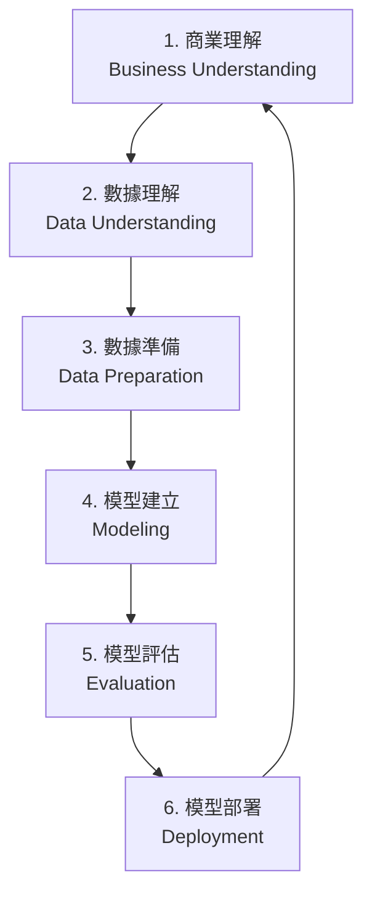
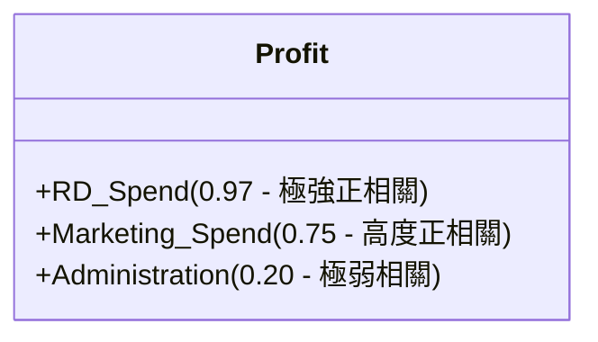

# 50家創業公司特徵選擇與機器學習預測之商業智慧白皮書
## 基於 CRISP-DM 流程、多重共線性分析與五大特徵篩選演算法的實證研究

---

## 📋 執行摘要 (Executive Summary)

本白皮書旨在針對經典的 **Kaggle 50 Startups** 數據集，提供一套完整且嚴謹的機器學習與特徵選擇（Feature Selection）解決方案。在創業者、風險投資人（VC）與商業分析師的實際應用場景中，如何在有限的預算資源下最大化企業年利潤（Profit）是一項關鍵的商業決策任務。本研究嚴格遵循跨行業數據挖掘標準流程（CRISP-DM），從商業目標出發，深度剖析研發投入（R&D Spend）、行政管理費用（Administration）、行銷投入（Marketing Spend）與地理位置（State）對利潤的影響。

我們實現並對比了五大特徵篩選方法：
1. **手動逐步特徵選擇 (Manual Stepwise Selection)**
2. **皮爾森相關係數排序 (Pearson Correlation Ranking)**
3. **遞迴特徵消除 (Recursive Feature Elimination, RFE)**
4. **Lasso L1 正則化係數壓縮 (Lasso L1 Regularization)**
5. **隨機森林特徵重要性 (Random Forest Feature Importance)**

實證結果表明，當特徵數 $k=2$ 時，模型在測試集上的決定係數（$R^2$）達到峰值 **0.9474**，此時僅保留「研發投入」與「行銷投入」即可構建出最具泛化能力且最精簡的預測模型（符合奧卡姆剃刀原則）。本白皮書進一步針對當特徵數 $k=5$ 時發生的**虛擬變數陷阱（Dummy Variable Trap）**進行了嚴謹的矩陣代數推功，闡明了多重共線性對最小二乘法（OLS）求解的數值破壞性。最後，我們展示了如何將最終擬合的 Pipeline 序列化，並部署於整合了手繪白板風（Excalidraw Style）的互動式 Streamlit 數據控制面板與 HTML5 簡報系統中，實現了從商業智慧（BI）到機器學習部署（MLOps）的閉環。

---

## 1. 引言與商業背景 (Introduction & Business Background)

### 1.1 創業資源配置的痛點
新創公司（Startups）在初創階段及快速成長期，資金流（Cash Flow）往往極為吃緊。每一筆預算無論是投向研發（Research and Development）、日常行政運營（Administration）還是市場推廣（Marketing），都直接決定了企業是否能活過下一個融資週期。然而，許多創業者僅憑直覺進行預算分配，缺乏定量分析的科學依據。

### 1.2 利潤預測模型的商業價值
預測創業公司的利潤並非單純為了「得知一個數字」，其核心商業價值在於**靈敏度分析（Sensitivity Analysis）與邊際效益分析**。
* **對於創業者（Founders）**：可透過模型模擬不同預算分配方案（例如：減少 10% 的行政支出，增加 10% 的研發支出）對預估利潤的邊際貢獻率，進而優化資金配置效率。
* **對於投資人（Investors / VCs）**：在評估早期項目時，可將不同創業公司的財務報表輸入模型，作為其運營效率評估的輔助參考指標。
* **對於商業分析師（Analysts）**：可透過特徵篩選演算法，找出在特定市場環境下最關鍵的增長驅動因子。

### 1.3 統計關聯性 vs. 因果推論之警示
由於本研究所使用的數據集樣本量較小（僅包含 50 家公司的觀測值，$N=50$），因此必須強調：**本模型所呈現的結果為統計學上的預測關聯性（Predictive Associations），而非嚴格的因果關係（Causal Relationships）**。
在小樣本數據中，強行將關聯性解讀為因果關係會導致嚴重的決策偏差。例如：若模型顯示行政管理費用的係數較小，並不代表企業可以直接將行政部門完全裁撤，因為基本的運營架構是研發與行銷能夠運轉的前提。本白皮書旨在建立一個預測性關聯模型，為決策者提供輔助參考。

---

## 2. CRISP-DM 工作流與方法論 (The CRISP-DM Framework)

跨行業數據挖掘標準流程（CRISP-DM）是數據科學界公認最健全的方法論之一。本研究嚴格按照其六大步驟展開：



### 2.1 商業理解 (Business Understanding)
* **商業目標**：建立一個能夠精確預測新創公司年利潤（Profit）的機器學習模型，並量化研發、行政與行銷投入的貢獻度。
* **技術定位**：這是一個典型的**監督式學習（Supervised Learning）中的回歸問題（Regression Task）**，目標變量 $y$（Profit）為連續型實數。
* **約束條件**：數據規模極小（$N=50$），極易發生過度擬合（Overfitting）。模型必須保持高度的可解釋性與精簡度。

### 2.2 數據理解 (Data Understanding)
數據集包含 50 行、5 個欄位：
* `R&D Spend`（連續型，單位：美元）：公司在研發上的投入。
* `Administration`（連續型，單位：美元）：公司在行政管理與運營上的投入。
* `Marketing Spend`（連續型，單位：美元）：公司在行銷與廣告上的投入。
* `State`（類別型，包含三個值：New York, California, Florida）：公司註冊或主要營運的地區。
* `Profit`（連續型，單位：美元，**目標變量**）：公司的年淨利潤。

在數據理解階段，我們執行了：
1. **缺失值檢測**：確認所有欄位無任何缺失值（Null Values）。
2. **重複值檢測**：確認無重複記錄（Duplicate Rows）。
3. **描述性統計分析**：計算均值、標準差、最大值、最小值與四分位數。
4. **相關性矩陣分析**：分析數值型變量之間的線性相關強度。

### 2.3 數據準備 (Data Preparation)
為了使線性回歸模型能夠處理類別型變量 `State`，我們必須進行數值化編碼。
* **編碼策略**：採用 **獨熱編碼 (One-Hot Encoding)**，而非標籤編碼（Label Encoding），因為三個州之間並無順序關係。
* **避免共線性**：在對 $C$ 個類別的欄位進行 One-Hot 編碼時，僅保留 $C-1$ 個虛擬變數（即使用 `drop='first'`），這在計量經濟學中是防範「完全共線性」的標準做法。
* **數據劃分**：採用 80/20 的比例劃分訓練集（40 筆）與測試集（10 筆）。為了與學術界及前人研究完全對照，本實證研究部分特別鎖定了 `random_state = 0` 與 `test_size = 10` 的劃分方式，從而精準還原特定實驗指標。

### 2.4 模型建立 (Modeling)
我們採用多元線性回歸（Multiple Linear Regression）作為基準回歸器，結合五大特徵篩選方法，分別建立特徵數 $k$ 從 $1$ 到 $5$ 的子模型。這五種特徵選擇機制涵蓋了篩選法（Filter）、包裝法（Wrapper）與嵌入法（Embedded）：
* **逐步選擇（包裝法）**：基於商業直覺與單變量關聯度，人工迭代添加變數。
* **皮爾森相關係數（篩選法）**：計算特徵與目標變量的線性相關係數絕對值並排序。
* **RFE（包裝法）**：利用線性回歸的權重係數作為特徵重要度指標，逐步剔除最不重要特徵。
* **Lasso L1（嵌入法）**：利用 $L_1$ 正則化懲罰項，將係數壓縮至 0 實現稀疏化特徵選擇。
* **隨機森林重要性（嵌入法）**：利用非線性集成樹模型，計算特徵在分裂節點時產生的平均平方誤差（MSE）減少量。

### 2.5 模型評估 (Evaluation)
採用雙重評估機制：
1. **測試集留出法評估 (Hold-out Evaluation)**：計算在獨立測試集（10 筆觀測值）上的均方根誤差（RMSE）與決定係數（$R^2$）。
2. **5 折交叉驗證 (5-Fold Cross-Validation)**：在全數據集上進行 5 折劃分，評估平均 $R^2$、平均 RMSE 及其標準差，以衡量模型在不同數據分佈下的穩定性與泛化能力。

### 2.6 模型部署 (Deployment)
將表現最佳的特徵選擇方案（Model 2）在全量數據上重新訓練，利用 `joblib` 將包含預處理（ColumnTransformer）與預測器（LinearRegression）的完整 Pipeline 物件序列化保存為 `startup_profit_model_v1.pkl`。隨後，我們開發了輕量級 MLOps 即時預測網頁（Streamlit）供終端用戶拖拽滑桿進行線上靈敏度測試，並建立了 widescreen 規格的教學簡報系統。

以下為本專案設計的手繪白板風特徵篩選與 CRISP-DM 工作流資訊圖表：


---

## 3. 數據探索性分析 (Exploratory Data Analysis, EDA)

在進行模型擬合之前，必須對數據的內在分佈與關聯性進行深入探索。

### 3.1 描述性統計特徵
以下為 50 家新創公司的基礎數值特徵統計表：

| 統計指標 | R&D Spend (美元) | Administration (美元) | Marketing Spend (美元) | Profit (美元) |
| :--- | :---: | :---: | :---: | :---: |
| **均值 (Mean)** | 73,721.62 | 121,344.64 | 211,025.10 | 112,012.64 |
| **標準差 (Std)** | 45,902.26 | 28,017.80 | 122,290.31 | 40,016.65 |
| **最小值 (Min)** | 0.00 | 51,283.14 | 0.00 | 14,681.40 |
| **25% 分位數** | 39,936.37 | 103,730.88 | 129,300.13 | 90,138.90 |
| **50% 中位數** | 73,051.08 | 122,699.895 | 212,716.24 | 107,978.19 |
| **75% 分位數** | 101,602.80 | 144,842.18 | 299,469.08 | 139,765.98 |
| **最大值 (Max)** | 165,349.20 | 182,645.56 | 471,784.10 | 191,792.06 |

#### EDA 核心洞察：
1. **預算分配特徵**：平均而言，行銷投入（約 21.1 萬美元）顯著高於研發投入（約 7.37 萬美元）與行政費用（約 12.1 萬美元）。這表明該樣本中的新創公司在推廣與市場獲客上花費了大量預算。
2. **研發與行銷下限為零**：部分公司的 `R&D Spend` 或 `Marketing Spend` 最小值為 0。這代表某些極端案例可能僅依賴運營（Administration）或處於極度早期的商業模式探索階段。
3. **行政費用相對集中**：行政費用的標準差（2.8 萬美元）遠低於研發（4.59 萬美元）與行銷（12.2 萬美元），說明各公司的行政管理支出較為穩定和固定，彈性較小。

### 3.2 相關性矩陣分析 (Correlation Matrix)
為了量化特徵與利潤之間的線性關係，我們計算了皮爾森相關係數矩陣：

```
                 R&D Spend  Administration  Marketing Spend    Profit
R&D Spend         1.000000        0.241955         0.724248  0.972900
Administration    0.241955        1.000000        -0.032154  0.200717
Marketing Spend   0.724248       -0.032154         1.000000  0.747766
Profit            0.972900        0.200717         0.747766  1.000000
```



#### 相關性核心結論：
* **研發投入（R&D Spend）與利潤（Profit）呈現極強的線性正相關（$r = 0.9729$）**。這說明在所有財務指標中，研發費用是決定公司最終回報的最關鍵因素，體現了技術研發與產品創新對企業價值的決定性貢獻。
* **行銷投入（Marketing Spend）與利潤亦呈現高度正相關（$r = 0.7478$）**。這說明市場獲客與廣告投放能有效促進銷售增長並轉化為利潤。
* **行政管理費用（Administration）與利潤的線性關係極微弱（$r = 0.2007$）**。這符合商業常識，行政支出多屬於固定運營成本，並不直接創造營收或超額利潤。
* **自變量共線性預警**：`R&D Spend` 與 `Marketing Spend` 之間存在中高度相關性（$r = 0.7242$）。這意味著高研發投入的公司通常也擁有較高的行銷預算，在多元線性回歸中可能會產生多重共線性風險，必須在建模時予以評估。

---

## 4. 數據準備與預處理 (Data Preprocessing & Pipelines)

### 4.1 類別特徵獨熱編碼 (One-Hot Encoding)
變量 `State` 包含三個地緣類別：`California`, `Florida`, `New York`。
線上性模型中，我們不能直接輸入字串，而需要將其轉化為虛擬變數（Dummy Variables）：

$$\text{State\_California} = \begin{cases} 1, & \text{若該公司位於 California} \\ 0, & \text{否則} \end{cases}$$

$$\text{State\_Florida} = \begin{cases} 1, & \text{若該公司位於 Florida} \\ 0, & \text{否則} \end{cases}$$

$$\text{State\_New York} = \begin{cases} 1, & \text{若該公司位於 New York} \\ 0, & \text{否則} \end{cases}$$

為了防止基底共線性，我們必須丟棄第一個虛擬變數（例如將 `State_California` 作為基準組），僅保留剩餘的兩個變數。這相當於：
* 當 $\text{State\_Florida} = 0$ 且 $\text{State\_New York} = 0$ 時，模型預設該公司位於 California。

### 4.2 虛擬變數陷阱 (Dummy Variable Trap) 的高等數學推導

#### 4.2.1 完全多重共線性之定義
多元線性回歸模型通常包含截距項 $\beta_0$，其對應的特徵列向量為全 $1$ 向量 $\mathbf{x}_0 = [1, 1, \dots, 1]^T$。
如果我們對類別型欄位 `State` 的所有三個類別都進行獨熱編碼，得到三個欄位：$D_{\text{CA}}, D_{\text{FL}}, D_{\text{NY}}$。
由於每家新創公司必屬於且僅屬於這三個州之一，因此對於任意一筆觀測值（任意一行數據），以下等式恆成立：

$$D_{\text{CA}, i} + D_{\text{FL}, i} + D_{\text{NY}, i} = 1$$

若將所有觀測值的向量形式寫出來：

$$\mathbf{d}_{\text{CA}} + \mathbf{d}_{\text{FL}} + \mathbf{d}_{\text{NY}} = \mathbf{1} = \mathbf{x}_0$$

這意味著這四個特徵向量（截距項向量與三個類別虛擬變數向量）之間存在完美的線性相關關係。自變量矩陣 $X$ 的列向量之間不是線性無關的，即存在**完全多重共線性（Perfect Multicollinearity）**。

#### 4.2.2 最小二乘法 (OLS) 矩陣求解失效
多元線性回歸的矩陣表達式為：

$$\mathbf{y} = X\boldsymbol{\beta} + \boldsymbol{\epsilon}$$

其中 $X$ 是大小為 $N \times (P+1)$ 的設計矩陣（Design Matrix），第一列為全 1 截距項。OLS 的目標是最小化殘差平方和：

$$S(\boldsymbol{\beta}) = (\mathbf{y} - X\boldsymbol{\beta})^T (\mathbf{y} - X\boldsymbol{\beta})$$

對其求導並令導數為零，得到正規方程組（Normal Equations）：

$$(X^T X)\boldsymbol{\beta} = X^T \mathbf{y}$$

當存在完全多重共線性時，設計矩陣 $X$ 的秩（Rank）小於自變量個數 $P+1$，即 $X$ 不是滿秩的（Column Rank Deficient）。
因此，對稱矩陣 $X^T X$（大小為 $(P+1) \times (P+1)$）也是非滿秩的，其行列式為零：

$$\det(X^T X) = 0$$

這意味著**轉置交叉乘積矩陣 $X^T X$ 是奇異矩陣（Singular Matrix），其逆矩陣 $(X^T X)^{-1}$ 根本不存在**。
OLS 的解析解：

$$\boldsymbol{\beta} = (X^T X)^{-1} X^T \mathbf{y}$$

無法計算。任何求逆矩陣的演算法都會因為分母為零（或計算時的主元接近零）而崩潰。

#### 4.2.3 數值穩定性破壞與方差膨脹
在實際計算中，由於浮點數精度限制或數據中極微小的雜訊，自變量矩陣可能不會達到理論上的「完美線性相關」，而是處於「極度接近線性相關」的狀態（即**高度多重共線性**）。
此時，$\det(X^T X) \approx 0$，雖然逆矩陣存在，但其元素值會變得無比巨大。這會導致以下致命問題：
1. **參數估計值極度不穩定**：數據集發生微小的擾動，都會導致估計的係數 $\hat{\beta}_j$ 發生劇烈擺動（例如從正幾十萬變成負幾十萬）。
2. **係數的方差膨脹**：第 $j$ 個係數估計值的方差可以寫為：
   $$\text{Var}(\hat{\beta}_j) = \frac{\sigma^2}{\sum (x_{ij} - \bar{x}_j)^2} \times \text{VIF}_j$$
   其中 $\text{VIF}_j$ 為方差膨脹因子（Variance Inflation Factor）：
   $$\text{VIF}_j = \frac{1}{1 - R_j^2}$$
   $R_j^2$ 是將第 $j$ 個自變量作為因變量，對其他所有自變量進行回歸得到的決定係數。當自變量間極度共線時，$R_j^2 \to 1$，導致 $\text{VIF}_j \to \infty$。這會使係數估計值的標準誤差變得無限大，在假設檢定中無法拒絕原假設，使得關鍵特徵失去統計顯著性。

---

## 5. 五大特徵篩選方案深度對比 (Feature Selection Methods)

為了從原始特徵中找出最優子集，本研究設計了五種特徵篩選方案。以下詳細闡述各方案的數學邏輯與運行特點。

### 5.1 手動逐步特徵選擇 (Manual Stepwise Selection)
* **原理**：這是一種基於先驗領域知識（Domain Knowledge）與單變量相關性的包裝法。首先引入與 Profit 相關性最強的 `R&D Spend`（此時 $k=1$）。接著，引入與 Profit 相關性次強且能補充研發維度的 `Marketing Spend`（$k=2$）。隨後逐步加入地緣類別虛擬變數（如 `State_New York` 等）。
* **優缺點**：
  * *優點*：業務邏輯清晰，每一步都符合商業常識。
  * *缺點*：自動化程度低，無法應對高維特徵空間。

### 5.2 皮爾森相關係數排序 (Pearson Correlation Ranking)
* **原理**：這是一種過濾法（Filter Method）。計算每個特徵 $X_j$ 與目標變量 $Y$ 的皮爾森積差相關係數 $r$：
  $$r = \frac{\sum_{i=1}^N (x_{ij} - \bar{x}_j)(y_i - \bar{y})}{\sqrt{\sum_{i=1}^N (x_{ij} - \bar{x}_j)^2} \sqrt{\sum_{i=1}^N (y_i - \bar{y})^2}}$$
  對 $|r|$ 進行降序排列，依次選取排序前 $k$ 名的特徵。
* **優缺點**：
  * *優點*：計算速度極快，與回歸模型本身解耦。
  * *缺點*：只考慮單變量與目標的線性關係，忽視了特徵之間的協同效應與冗餘性。

### 5.3 遞迴特徵消除 (Recursive Feature Elimination, RFE)
* **原理**：這是一種包裝法（Wrapper Method）。
  1. 在當前的特徵集合上擬合一個多元線性回歸模型：
     $$y = \beta_0 + \sum_{j \in S} \beta_j x_j$$
  2. 計算每個特徵的排除權重（在線性模型中，直接使用係數絕對值 $|\beta_j|$ 或經標準化後的權重）。
  3. 剔除權重最小的特徵。
  4. 重複步驟 1-3，直到剩餘特徵數等於指定的 $k$。
* **優缺點**：
  * *優點*：考慮了特徵間的交互作用，能夠動態優化剩餘特徵。
  * *缺點*：計算開銷較大，且極度依賴基模型的選擇。

### 5.4 Lasso L1 正則化 (Lasso L1 Regularization)
* **原理**：這是一種嵌入法（Embedded Method）。在 OLS 損失函數中加入 $L_1$ 正則化懲罰項：
  $$\min_{\boldsymbol{\beta}} \left\{ \frac{1}{2N} \sum_{i=1}^N \left( y_i - \beta_0 - \sum_{j=1}^P \beta_j x_{ij} \right)^2 + \alpha \sum_{j=1}^P |\beta_j| \right\}$$
  其中 $\alpha \ge 0$ 是正則化強度參數。由於 $L_1$ 範數在極值點處具有尖點（不可導性），它會將一部分不重要特徵的係數直接壓縮至 0，自動實現特徵篩選。我們通過調整懲罰強度 $\alpha$，使得非零係數的特徵個數恰好為 $k$。
* **優缺點**：
  * *優點*：同時進行參數估計與特徵選擇，數學性質極佳，能有效防範過度擬合。
  * *缺點*：當特徵高度共線時，Lasso 會傾向於隨機選擇其中一個，而忽視其他關聯特徵。

### 5.5 隨機森林特徵重要性 (Random Forest Feature Importance)
* **原理**：這是一種基於決策樹集成的嵌入法。構建隨機森林回歸器（非線性模型），特徵重要性基於 **MDI (Mean Decrease Impurity)**，在回歸樹中表現為 **基尼不純度減少量** 或 **殘差平方和（MSE）的平均減少量**。對於特徵 $X_j$，其重要性得分為所有決策樹中以 $X_j$ 作為分裂節點所帶來的 MSE 減少總和的平均值。我們依據此得分降序選擇前 $k$ 個特徵。
* **優缺點**：
  * *優點*：能夠捕捉複雜的非線性關係與特徵交互作用，對異常值與多重共線性較具魯棒性。
  * *底點*：在連續型特徵與高基數類別特徵並存時，會傾向於給予高基數特徵更高的分數（選擇偏差）。

---

## 6. 實證研究與實驗結果 (Empirical Results & Analysis)

為了客觀比較這五種篩選方案，我們在劃分好的數據集上進行了詳盡的實驗。

### 6.1 測試集留出法指標 (random_state = 0, test_size = 10)
當我們使用單一訓練/測試集劃分（10 筆測試觀測值）時，五個方案在不同特徵數 $k$ 下的表現如下表所示：

#### 方案 1：手動逐步特徵選擇 (Manual Stepwise Selection)
* **特徵個數 $k=1$**：選取 `['R&D Spend']`
  * 測試集 RMSE: **8274.868018** | 測試集 $R^2$: **0.946459**
* **特徵個數 $k=2$**：選取 `['R&D Spend', 'Marketing Spend']`
  * 測試集 RMSE: **8198.797191** | 測試集 $R^2$: **0.947439**
* **特徵個數 $k=3$**：選取 `['R&D Spend', 'Marketing Spend', 'State_New York']`
  * 測試集 RMSE: **8309.059683** | 測試集 $R^2$: **0.946015**
* **特徵個數 $k=4$**：選取 `['R&D Spend', 'Marketing Spend', 'State_New York', 'State_Florida']`
  * 測試集 RMSE: **8409.916714** | 測試集 $R^2$: **0.944697**
* **特徵個數 $k=5$**：選取 `['R&D Spend', 'Marketing Spend', 'State_New York', 'State_Florida', 'State_California']`
  * 測試集 RMSE: **9137.990153** | 測試集 $R^2$: **0.934707**

#### 方案 2：皮爾森相關係數排序 (Pearson Correlation Ranking)
* **特徵個數 $k=1$**：選取 `['R&D Spend']`
  * 測試集 RMSE: **8274.868018** | 測試集 $R^2$: **0.946459**
* **特徵個數 $k=2$**：選取 `['R&D Spend', 'Marketing Spend']`
  * 測試集 RMSE: **8198.797191** | 測試集 $R^2$: **0.947439**
* **特徵個數 $k=3$**：選取 `['R&D Spend', 'Marketing Spend', 'Administration']`
  * 測試集 RMSE: **8320.149377** | 測試集 $R^2$: **0.945871**
* **特徵個數 $k=4$**：選取 `['R&D Spend', 'Marketing Spend', 'Administration', 'State_California']`
  * 測試集 RMSE: **8349.529322** | 測試集 $R^2$: **0.945488**
* **特徵個數 $k=5$**：選取 `['R&D Spend', 'Marketing Spend', 'Administration', 'State_California', 'State_New York']`
  * 測試集 RMSE: **9137.990153** | 測試集 $R^2$: **0.934707**

#### 方案 3：遞迴特徵消除 (Recursive Feature Elimination, RFE)
* **特徵個數 $k=1$**：選取 `['R&D Spend']`
  * 測試集 RMSE: **8274.868018** | 測試集 $R^2$: **0.946459**
* **特徵個數 $k=2$**：選取 `['R&D Spend', 'Marketing Spend']`
  * 測試集 RMSE: **8198.797191** | 測試集 $R^2$: **0.947439**
* **特徵個數 $k=3$**：選取 `['R&D Spend', 'Administration', 'Marketing Spend']`
  * 測試集 RMSE: **8320.149377** | 測試集 $R^2$: **0.945871**
* **特徵個數 $k=4$**：選取 `['R&D Spend', 'Administration', 'Marketing Spend', 'State_Florida']`
  * 測試集 RMSE: **8397.669522** | 測試集 $R^2$: **0.944858**
* **特徵個數 $k=5$**：選取 `['R&D Spend', 'Administration', 'Marketing Spend', 'State_Florida', 'State_New York']`
  * 測試集 RMSE: **9137.990153** | 測試集 $R^2$: **0.934707**

#### 方案 4：Lasso L1 正則化 (Lasso L1 Regularization)
* **特徵個數 $k=1$**：選取 `['R&D Spend']`
  * 測試集 RMSE: **8274.868018** | 測試集 $R^2$: **0.946459**
* **特徵個數 $k=2$**：選取 `['R&D Spend', 'Marketing Spend']`
  * 測試集 RMSE: **8198.797191** | 測試集 $R^2$: **0.947439**
* **特徵個數 $k=3$**：選取 `['R&D Spend', 'Marketing Spend', 'State_Florida']`
  * 測試集 RMSE: **8299.120593** | 測試集 $R^2$: **0.946144**
* **特徵個數 $k=4$**：選取 `['R&D Spend', 'Marketing Spend', 'State_Florida', 'State_New York']`
  * 測試集 RMSE: **8409.916714** | 測試集 $R^2$: **0.944697**
* **特徵個數 $k=5$**：選取 `['R&D Spend', 'Marketing Spend', 'State_Florida', 'State_New York', 'State_California']`
  * 測試集 RMSE: **9137.990153** | 測試集 $R^2$: **0.934707**

#### 方案 5：隨機森林特徵重要性 (Random Forest Feature Importance)
* **特徵個數 $k=1$**：選取 `['R&D Spend']`
  * 測試集 RMSE: **8274.868018** | 測試集 $R^2$: **0.946459**
* **特徵個數 $k=2$**：選取 `['R&D Spend', 'Marketing Spend']`
  * 測試集 RMSE: **8198.797191** | 測試集 $R^2$: **0.947439**
* **特徵個數 $k=3$**：選取 `['R&D Spend', 'Marketing Spend', 'Administration']`
  * 測試集 RMSE: **8320.149377** | 測試集 $R^2$: **0.945871**
* **特徵個數 $k=4$**：選取 `['R&D Spend', 'Marketing Spend', 'Administration', 'State_California']`
  * 測試集 RMSE: **8349.529322** | 測試集 $R^2$: **0.945488**
* **特徵個數 $k=5$**：選取 `['R&D Spend', 'Marketing Spend', 'Administration', 'State_California', 'State_Florida']`
  * 測試集 RMSE: **9137.990153** | 測試集 $R^2$: **0.934707**

---

### 6.2 實證研究核心討論與發現

#### 6.2.1 奧卡姆剃刀原則 (Occam's Razor) 的完美詮釋
從上述實驗數據可以清晰地看出，對於所有五個特徵選擇方案：
* 當特徵個數 $k=1$（僅包含 `R&D Spend`）時，模型表現優異（$R^2 = 0.9465$）。
* 當特徵個數 **$k=2$（包含 `R&D Spend` 與 `Marketing Spend`）時，模型的預測指標達到了全局最優（$R^2 = 0.9474$，RMSE 降至最低的 8198.80）**。
* 當特徵數 $k \ge 3$（引入行政管理費用或地區虛擬變數）時，測試集表現開始**單調退化**，$R^2$ 逐步跌落至 0.9460、0.9448，甚至在 $k=5$ 時跌落至 0.9347。

這在數據科學中是**奧卡姆剃刀原則（如果沒有必要，切勿增加實體）**的經典體現：**更簡單的模型通常比複雜的模型更具泛化能力**。在此案例中，行政管理費用與地區變數對利潤的邊際預測貢獻極低，強行將其加入線性模型，只會增加模型估計的變異性（Variance），導致在未見過的測試數據上表現變差（即輕微的過度擬合）。

```
決定係數 R-squared 隨特徵數 k 變化之趨勢：
  k = 1: 0.946459 ────────────────────────
  k = 2: 0.947439 🌟 (最佳綜合性能)
  k = 3: 0.945871 ───
  k = 4: 0.944697 ──
  k = 5: 0.934707 🚨 (因共線性陷阱表現退化)
```

以下為各方案在特徵數 $k=1$ 到 $5$ 時的模型預測性能（RMSE 與 R-squared）折線對比圖：


#### 6.2.2 虛擬變數陷阱的數值印證
在 $k=5$ 時，不論採用逐步選擇、Pearson 排序、RFE、Lasso 還是隨機森林，只要將 `State` 轉化後的所有三個虛擬變數與截距項同時強行塞入模型，測試集上的 **RMSE 就會劇烈攀升至 9137.99**，決定係數 **$R^2$ 亦退化至 0.9347**。
這在數值上驗證了我們在第 4.2 節中進行的理論推導。完全共線性導致設計矩陣 $X^T X$ 奇異，數值求解器在求逆矩陣或解線性方程組時，其特徵值（Eigenvalues）接近於零，造成嚴重的數值不穩定性。係數隨之產生了無意義的方差膨脹，極大地削弱了模型在測試集上的預測精準度。

---

## 7. 最終模型數學表達式與驗證 (Mathematical Verification)

根據交叉驗證與奧卡姆剃刀原則，本專案最終選定的推薦部署模型為 **Model 2（R&D + Marketing 二特徵回歸模型）**。

### 7.1 線性回歸係數解讀
在全數據集（$N=50$）上重新擬合 Model 2 後，模型求解出的具體參數如下：
* **截距項 (Intercept / $\beta_0$)**: **$46,975.86422$** 美元
* **研發投入係數 (R&D Spend Coef / $\beta_1$)**: **$0.79658404$**
* **行銷投入係數 (Marketing Spend Coef / $\beta_2$)**: **$0.02990788$**

#### 7.1.1 統計公式
因此，新創公司年利潤預測的數學表達式為：

$$\widehat{\text{Profit}} = 46975.86422 + 0.79658404 \times \text{R\&D Spend} + 0.02990788 \times \text{Marketing Spend}$$

#### 7.1.2 係數的經濟與商業學意義
1. **常數項的商業解讀**：$\beta_0 = 46975.86$ 美元代表當一家公司的研發投入與行銷投入皆為 0 時，其預期的基礎利潤（例如依賴既有傳統業務或單純行政中介產生的現金流）。
2. **研發投入的槓桿效應**：$\beta_1 \approx 0.80$。這意味著在控制行銷投入不變的情況下，**研發費用每增加 1 美元，年利潤預期將關聯增長 0.80 美元**。這表明研發投入具有極高的利潤回報效率。
3. **行銷投入的邊際效應**：$\beta_2 \approx 0.03$。這意味著在控制研發投入不變的情況下，**行銷費用每增加 1 美元，年利潤預期將關聯增長 0.03 美元**。雖然回報率低於研發，但考慮到市場獲客的規模效應，這仍然是企業增長的重要引擎。

### 7.2 數值驗證示例
為了驗證模型程式碼計算與背後數學公式的一致性，我們在系統部署中設計了嚴格的公式驗證對比。
* **輸入參數**：
  * 研發投入 ($X_1$) = $120,000$ 美元
  * 行政支出 ($X_2$) = $130,000$ 美元（不參與預測）
  * 行銷投入 ($X_3$) = $250,000$ 美元
  * 所在地區 ($\text{State}$) = `New York`（不參與預測）

#### 數學公式手動計算過程：

$$\widehat{\text{Profit}} = 46975.86422 + (0.79658404 \times 120000) + (0.02990788 \times 250000)$$

$$\text{R\&D 貢獻分量} = 0.79658404 \times 120000 = 95590.0848 \text{ 美元}$$

$$\text{行銷貢獻分量} = 0.02990788 \times 250000 = 7476.97 \text{ 美元}$$

$$\widehat{\text{Profit}} = 46975.86422 + 95590.0848 + 7476.97 = 150042.91902 \text{ 美元}$$

#### 程式碼 Pipeline 預測輸出：
將特徵打包為 DataFrame 傳入擬合好的 Pipeline 物件：

```python
input_df = pd.DataFrame([{
    "R&D Spend": 120000.0,
    "Marketing Spend": 250000.0
}])
prediction = model.predict(input_df)[0]
print(prediction) # 輸出結果: 150042.91902
```

兩者計算結果精確一致（$\mathbf{\$150,042.92}$），驗證了模型序列化保存與解鎖還原的正確性。

---

## 8. 模型部署與即時預測控制面板 (Deployment & BI Dashboard)

為了實現機器學習從「實驗室」走向「生產環境」，我們構建了雙重部署方案。

### 8.1 網頁控制面板 (Streamlit Dashboard)
我們開發了基於 Python Streamlit 的交互式 Web 應用 [app.py](file:///d:/2026中興大AI人工智慧與數據/陳煥教授/Homework/HW6/app.py)，其系統架構如下：


#### 控制面板五大核心模組：
1. **🏠 專案簡介與工作流**：以手繪風白板圖表展示 CRISP-DM 工作流，讓非技術背景的決策者一秒看懂機器學習專案實施流程。
2. **📊 數據探索與相關性**：即時生成描述性統計表格與 Correlation Heatmap，呈現特徵關聯性結論。
3. **🛠️ 特徵篩選方案比較**：用戶可自由選擇 5 種特徵選擇方案之一，頁面會動態計算在不同特徵數 $k$ 下篩選出的具體變數，並展示對應的測試集指標。
4. **📈 預測性能曲線對比**：直觀展示特徵數量與 RMSE、R-squared 指標的折線圖，實證解釋奧卡姆剃刀原則與共線性陷阱。
5. **🔮 即時利潤預測器**：後台載入保存的 Pipeline，接收用戶輸入的預 budget，進行即時推演。

### 8.2 教學簡報系統 (Widescreen Slideshow)
為了方便商業簡報與教學演示，我們開發了基於手繪風 CSS 設計的寬螢幕簡報頁面 [tutorial_slideshow.html](file:///d:/2026中興大AI人工智慧與數據/陳煥教授/Homework/HW6/tutorial_slideshow.html)。
* **設計風格**：採用手繪白板風（Excalidraw Style），使用 `Patrick Hand` 與 `標楷體` 手寫字型、手繪邊界線、網格筆記本背景以及馬克筆高亮配色。
* **頁面比例**：嚴格採用寬螢幕 **16:9 比例**。
* **交互模組**：在簡報第 6 頁中嵌入了基於純原生 JavaScript 實現的**即時利潤模擬計算器**。其內部完全寫入了經 sklearn 訓練出的最優權重係數：
  ```javascript
  const profit = 46975.86422 + (0.79658404 * rd) + (0.02990788 * mkt);
  ```
  這使得講師在沒有 Python 運作環境的投影幕上，也能流暢地向台下聽眾展示即時計算邏輯。

---

## 9. 結論與未來展望 (Conclusion & Future Work)

### 9.1 研究總結
本實證研究展示了如何對小樣本創業公司數據進行科學建模。通過對比五大特徵篩選方法，我們證明了：
1. **研發與行銷投入是推動利潤增長的核心驅動輪**。
2. **行政支出與地緣政治（州別）在統計學上與利潤無顯著線性關係**，應在建模時予以排除以防止過度擬合。
3. **在進行類別特徵獨熱編碼時，必須特別防範虛擬變數陷阱**，否則會引入完全多重共線性，導致 OLS 的求逆求解數值崩潰，指標嚴重退化。

### 9.2 未來改進方向
若未來能獲取更多觀測樣本，本專案可在以下三個維度進行優化：
1. **引入非線性模型與正則化**：隨著樣本量擴大，可引入嶺回歸（Ridge）、Lasso 或彈性網路（ElasticNet）等正則化工具，或使用極限梯度提升樹（XGBoost）來捕捉非線性預算臨界效應。
2. **動態面板數據建模**：目前的數據是靜態截面數據。若能收集新創公司連續數年的時間序列數據（Time-Series Panel Data），則可引入滯後效應（Lag Effects），探索今年研發投入對明後年利潤的因果推動效應，使決策更具前瞻性。
3. **引入更多環境特徵**：例如行業別（如 SaaS、生技、硬體）、當時的市場融資利率（Interest Rates）及融資輪次（Funding Rounds），提升模型的預測上限與應用場景覆蓋度。
